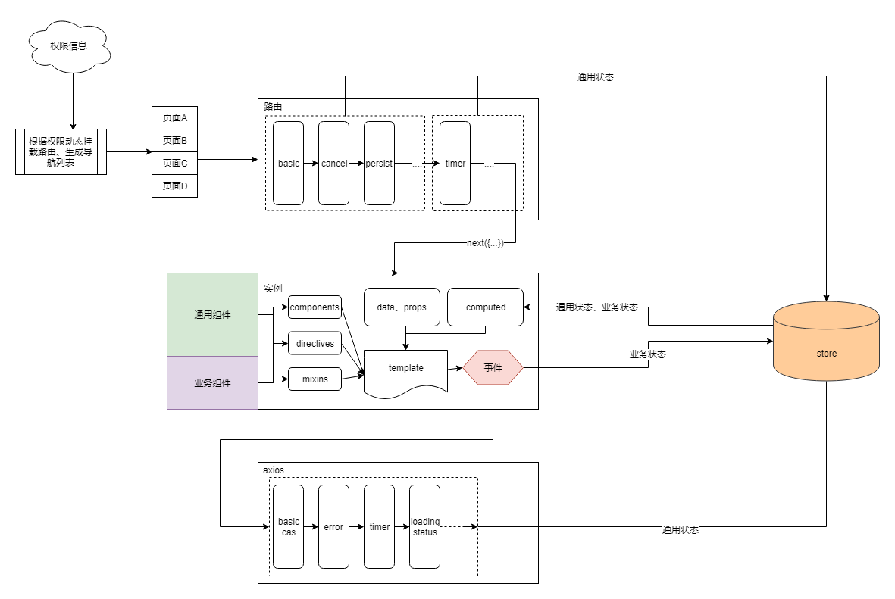

## 导火索

要加一个新功能，想了半天，愣是一行代码没写下去。我一直想，到底是什么东西在妨碍我，最后所有矛头都指向一点——缺少通用流程。

## 太年轻了

后悔没有先读《重构—改善既有代码的设计》这本书，如果我知道：

1. 尽量重构而不是重写，需要克制重新写一遍的冲动
2. 重构时每次只做一件事，避免涉及到多个功能点

我就不会一时冲动重写了一大半代码，也不会一次重写多个复杂功能点

## 重构的细节

主要有两方面的重构：

1.  全局通用流程的重构
2.  组件的重构

## 通用逻辑的重构
通用逻辑的重构的核心工作就是抽离冗余逻辑到全局的通用流程，充分利用：

- Vue的mixins
- Vue-Router的hooks
- Axios的interceptors
- Vuex和localStorage的无缝结合

## 整体流程

## Vue的mixins

1.  混入通用选项
2.  mixin和extend的使用场景区别
    1.  extend有更多的继承含义，有全局API：Vue.extend
    2.  mixin只是简单的混入选项  
3.  扩展UI组件库

## Vue-Router的hooks

-  使用hook在路由进入之前做一些体力活儿：
    -  数据准备
    -  数据检查
    -  数据缓存与恢复
    -  路由重定向
      
## Axios的interceptors

-  使用拦截器在请求、响应过程中做一些体力活儿：
   -  请求的cas认证
   -  请求的loading状态
   -  请求的timer计时
   -  响应的status状态

## Vuex和localStorage的结合

解决浏览器刷新后数据丢失的问题主要有两种方案:

1.  放到URL里
2.  放到浏览器本地

结合这两种，并借助Vue-Router的Hook，在切换路由时，自动恢复URL或者localStorage里的数据到Vuex。

## 组件的重构

重构的两个原则：

- 单向数据流
- 避免UI组件库的再次封装

## 单向数据流

原则：

- 避免直接修改组件的外部依赖状态
- 避免双向绑定复杂对象，尽量拆分成多个prop.sync
  - v-mode和.sync区别

优势：

- 单向数据流更加易懂
- 减少发现问题的难度

## 避免UI组件库的再次封装

- UI组件库的使用方式已经接近最佳实践，尽量避免粗暴的再次封装
  - 比如在metric-filter中使用的el-select组件
  - 使用slot的形式，编译时优于运行时，同时减少组件通信

- 如果组件不满足某些特定的需求，首先考虑扩展组件，而不是重写组件
  - UI组件库的扩展
  - 业务组件的扩展

## 感想

1.  针对某个功能点重构
2.  在充分理解原有代码的基础上进行重构
3.  最麻烦的是向下兼容
4.  多跟测试沟通，提测邮件里一定要写清楚所有涉及到的改动  

