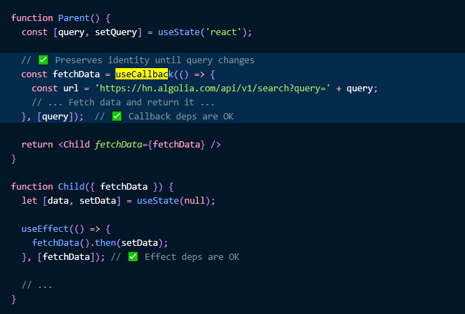
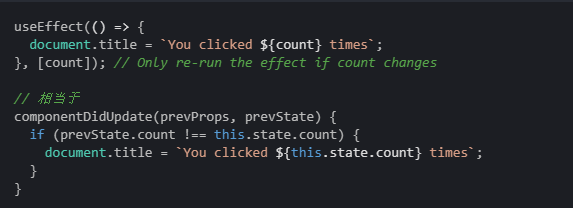

## un-learning

> 忘记你已经学到的。 — Yoda

> 当我不再透过熟悉的class生命周期方法去窥视useEffect 这个Hook的时候，我才得以融会贯通。

> React从未如此接近终极目标: `v = f(d)`

## 初识React Hooks的编程模型

- [DEMO](https://codesandbox.io/s/crazy-keldysh-jx8t9)

##
每次渲染都有特定的数据流：

- [DEMO](https://codesandbox.io/s/w2wxl3yo0l)

- [class DEMO](https://codesandbox.io/s/kkymzwjqz3)

##
函数也是数据流的一部分：

在class中，传递组件的方法容易存在潜在的问题，举个例子：


##
因为fetchData方法的引用是稳定的，同时子组件也无法窥探方法体里的内容是否发生变化，因此子组件必须借助一些额外的props来判断fetchData到底变没变。

这就导致我们不得不把不必要的props传递给子组件，同时破坏了组件的封装性。
```html
<Child {...props}></Child>
```

##
然而，在React Hooks中我们可以使用useCallback包裹我们的函数，如果函数的依赖变了，那函数的引用就会变，否则函数还是那个函数。

这完美的解决了上述问题，因此我们可以放心的把函数也当作数据流，同state和props一同放心的传递给子组件。

##


## 什么是副作用(Effect)

所有直接或间接影响DOM的行为都叫副作用：比如DOM操作、异步数据获取、监听、订阅。

副作用通常需要在DOM更新后再执行，因为我们写副作用的目的是：安全的修改DOM。

安全的修改DOM需要保证两点：

- 执行副作用之前，能获取到最新的DOM状态，避免读到”脏“值
- 执行副作用之后，我们对DOM的修改不会被错误的覆盖

## 初识useEffect

一个例子： [DEMO](https://codesandbox.io/s/still-water-fzn1e)

##
每次渲染都有特定的Effects：

Effect函数属于特定的渲染，就像事件处理函数一样。因此它能”看到“的props和state都来自于它属于的那次特定渲染。

一个例子：[DEMO](https://codesandbox.io/s/lyx20m1ol)

##
与class语义上的区别：
  
- 在使用基于响应生命周期的class编程模型中，我们更多的是在思考在各个阶段的生命周期中，我们应该分别做哪些事情。

- 但是在使用React Hooks的编程模型中，我们更多的思考是如何进行“状态同步”，没有mount的概念，也没有update的概念，只有"渲染"的概念。

> 如果你试图写一个effect会根据是否第一次渲染而表现不一致，你正在逆潮而动。

##
与class使用上的区别：
```jsx
// 这两者的区别是什么？
componentDidUpdate() {
  setTimeout(() => {
    console.log(`You clicked ${this.state.count} times`);
  }, 3000);
}
componentDidUpdate() {
  const count = this.state.count;
  setTimeout(() => {
    console.log(`You clicked ${count} times`);
  }, 3000);
}
```

##
```jsx
// effect看到的状态都是immutable的，是安全的
function Example() {
  const [count, setCount] = useState(0);

  useEffect(() => {
    setTimeout(() => {
      console.log(`You clicked ${count} times`);
    }, 3000);
  });
  // render ...
}
```

## 理解消除副作用
同样，我们应该用“消除副作用”来理解useEffect的清理函数，而不是用class的unmount去理解。它有两个个执行时机：

1. 组件卸载时
2. 在下一次effect执行之前

清理函数与effect函数一样，也是属于特定的某次渲染。

## 通过跳过Effect优化性能
通过useEffect的第二个参数：


建议使用：[eslint-plugin-react-hooks](https://www.npmjs.com/package/eslint-plugin-react-hooks#installation)来帮助我们检测依赖

## 一些常见的Effect优化场景

- [异步请求（把fetch函数写到Effect里面）](https://codesandbox.io/s/lucid-worker-4wbvf)
- [计时器（函数式更新）](https://codesandbox.io/s/busy-hooks-u2tki) 
- [剔除依赖（使用useReducer将依赖转化为描述）](https://codesandbox.io/s/focused-faraday-g7i7g)

## 实战例子

- [react-hooks-fetch-data](https://codesandbox.io/s/determined-clarke-vxsdy)

参考：https://www.robinwieruch.de/react-hooks-fetch-data/

## 需要持续关注的东西
1. [New Way For Data Fetching](https://reactjs.org/blog/2018/11/27/react-16-roadmap.html#react-16x-mid-2019-the-one-with-suspense-for-data-fetching)
   
   - 为什么Data Fetching在语义上很难与状态同步的概念融合
   - Data Fetching将从useEffect的功能中剔除
   - useEffect因此可能会退居幕后，作为用户在effect同步状态的有力工具
   - useEffect的依赖参数，后期可能会被React编译器自动填写

##
2. [React Newest Roadmap](https://reactjs.org/blog/2019/08/08/react-v16.9.0.html)
   - componentWillMount, componentWillReceiveProps, componentWillUpdate将会在16.9被重命名为UNSAFE_XXX
   - 以后可能会发布两个版本：Concurrent Mode | Suspense


<style type="text/css">
@import "../align.css";
</style>