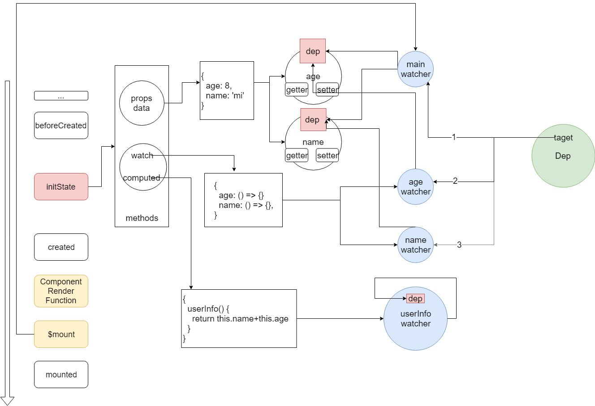

## 先收集一下问题
1. $set何时用，为什么用，原理是什么
2. 深层的对象不响应

## 面临的问题
> 我们正逐渐从前端工程师变成`配置`工程师

- 受制于框架给我们制定的`编程模型`中
- 每天的工作就是写配置文件👩🏻‍💻 
- 逐渐退化🐒

> 👨🏼我们把精力过度集中于这种配置文件，缺少了对框架的全面理解，被框架玩弄，此时框架就是我们的爸爸 

> 👶🏻为了扭转局面，为了为所欲为，我们需要看源码，要让框架成为我们的弟弟

[^_^]:
  关于全面理解，要重点强调，现在的MVX框架，屏蔽了VM这一层具体细节，我们只需要关注Model和View。虽然这样做，带来了开发上的便捷，但也给让我们对VM层的具体细节一无所知。

[^_^]:
  为所欲为的含义是，我们能在任何环境下使用Vue，而不是非要在.vue文件中,我们想怎么用怎么用

## 开始看代码
> 我们首先要找一个切入点，发现从`package.json`开始再好不过了
1. `package.json -> scripts -> dev:esm`
2. `scripts/config.js -> line: 55 alias`
3. `src/platforms/web/entry-runtime.js`
4. `src/platforms/web/runtime/index.js`
5. `src/core/index.js`
6. `src/core/instance/index.js`

总结： Vue其实就是个函数，他有一个很重要的构造函数，他的prototype上布满各种混入(mixin)的方法

---
> 我们开始找下一个切入点:

```js
new Vue({
  el: '#app',
  data() {
    return {
      name: 'vue',
      data: {version: 2.5}
    }
  }
})
```
1. `src/core/instance/index.js -> this._init(options) -> Vue.prototype -> initMixin(Vue)`
2. `src/core/instance/init.js -> line: 16 -> line: 55 -> line: 57`
3. `src/core/instance/state.js -> line: 54 -> line: 112 -> line: 147 -> line -> line: 151`
4. `src/core/observer/index -> line: 109`
   
    如果已经被observe过，则直接返回`__ob__`，大家应该看到过。否则，进行Observe化。

    `-> line: 37 -> line: 42`

    `__ob__`其实就是vm自己，不是Array，所以直接`this.walk(value)`

    `-> line: 63`

    遍历value所有key，对每一个key进行defineReactive
   
    `-> line: 134 -> line: 141 -> line: 155 -> line: 156`

    这里便是双向绑定的核心，准确的说是数据变化自动响应到视图这部分逻辑的核心
   
    先看get, balabala...

    再看set, balabala...

    短短40多行代码，要看懂却非常困难，所以我们先来一个大体的理解，有了这个理解，我们便可以理解下面这个图了

总结： 当我们执行new Vue(options)，我们传入的data的`现有的key`会被响应化(Observable)

> 下一个切入点，我们看一个熟悉的图


> 下一个切入点，我们从Vue的初始化过程入手

```js
const options = {各种属性}
new Vue(options)
```

1. 回到`src/core/instance/index.js`, 可以看到构造函数接受一个参数options
2. 看到构造函数有个`this._init`，其实是来自`initMixin`，继续看
3. `src/core/init -> Vue.prototype._init line: 52 -> line: 59, line: 69`
   1. initLifecycle：主要是关于视图更新的一些方法，`回头再看mountComponent`
   2. initEvents：事件相关，不是本次分享重点
   3. initRender: render相关, $createElement, $slots, $scopeSlots, 不是本次分享重点
   4. callHook(vm, 'beforeCreate')
   5. initInjections和initProvide：不是重点
   6. `initState：本次分享的重点`
   7. callHook(vm, 'created')
   8. `vm.$mount(vm.$options.el): 本次分享的重点`
4. 再回到`src/core/instance/index.js`，看剩下的几个mixin
   1. stateMixin：主要是混入state相关的方法，比如`$set, $watch`回头再看
   2. eventMixin: 事件相关，不是重点
   3. lifecycleMixin: 混入$forceUpdate, $destroy
   4. renderMixin：`回头再看$nextTick`

总结：到这里，我们稍微深入了一些，大概了解了Vue这个类，从光秃秃的一个函数，到一个全副武装的类的过程。接下来，我们要开始看具体的细节了。

> 我们再看一个图



> 下一个切入点，我们从问题出发

  1. 如何准确预测Vue的行为
     1. [如何优雅、准确的修改数据并触发更新](http://jsrun.net/HDhKp/edit)
     2. Vue3的trigger
   
  2. watch执行原理
     1. 既然我们能准确预测Vue的行为了，为什么还要看watch的原理
     2. [watch是怎样触发的, 怎样执行的](http://jsrun.net/kthKp/edit)
     3. [watch的immediate](http://jsrun.net/fthKp/edit)
     4. [watch为什么需要deep，而data不需要呢](http://jsrun.net/LthKp/edit)
     5. [watch和computed的区别，以及跟watcher的关系](http://jsrun.net/wthKp/edit)
     6. [watcher有几个，dep有几个, dep维持了几个watcher](http://jsrun.net/IthKp/edit)
     7. watcher,dep,Dep三者的联系
        1. Dep.target全局唯一，是为了保证同一时间只有一个watcher在watcher.evaluate这个过程


  3. [setTimeout和$nextTick的区别](http://jsrun.net/DDhKp/edit)
     1. [test1](http://jsrun.net/7thKp/edit)
     2. [test2](http://jsrun.net/cthKp/edit)
     3. [test3](http://jsrun.net/dthKp/edit)