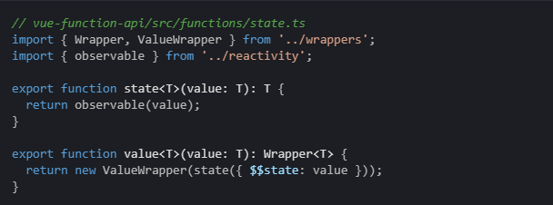

## 面临的问题

我们都见证过，一个组件从原本的清晰简洁，到后来的臃肿不堪，最终变得难以维护。

## 我们之前如何进行逻辑抽离

- Mixin：来源不清晰，命名冲突
- HOC：命名冲突，层层嵌套，额外的DOM渲染
- ScopedSlot：额外的DOM渲染，逻辑与视图混在一起

## 我们为什么要抛弃class

- 前端开发中，组合大于继承。我们大部分时间在写UI层的代码，很难维护一套稳定的接口或类
- this对框架初学者很不友好。同时，如果没有各种不稳定stage提案的支持下，代码会很臃肿
- class已经成为框架的开发者在编译技术上进一步优化的阻碍（[原文](https://reactjs.org/docs/hooks-intro.html#motivation)）

## 介绍新API

都是为了逻辑的纵向拆分

- [React's New API](https://zh-hans.reactjs.org/docs/hooks-reference.html)
- [Vue's New API](https://github.com/vuejs/rfcs/blob/function-apis/active-rfcs/0000-function-api.md#basic-example)

## React Hooks 基本原理
有篇文章很好的揭示了React Hooks的本质：

> [React hooks not magic just arrays](https://medium.com/@ryardley/react-hooks-not-magic-just-arrays-cd4f1857236e)

##


## 
注意点:

1.  state保持immutable，即每次调用setter都设置新值，否则会出现意想不到的问题，比如：
    - useEffect的依赖问题
    - 多次渲染中状态的读取问题：不能读取到当前渲染的状态，只能读到最新状态

2.  useState的setter是稳定的，同时要注意到自定义hooks的setter的稳定性

## Vue Function Based API 基本原理
通过 [vue-function-api](https://github.com/vuejs/vue-function-api) 这个插件，我们就知道，这个新API其实啥也没干，就是基于Vue2.6封装了一层，举个例子：

##


所以，Vue新API的原理等价于Vue数据视图双向绑定的原理。

## React和Vue的新API的区别

思想一样相似，技术实现完全不一样。

##

-   React Hooks是开创性的新功能，不仅改变了React基于class的开发方式，它甚至能引领时代潮流，成为未来框架的开发规范。

    Vue Function Based API学习了React Hooks的思想的"皮毛"。

##

-   React Hooks的实现是基于函数式组件，并在每个组件内部隐秘的维持了两个数组(?)，从而能基于useState的执行顺序获得维持状态的能力，并通过state对应的setter进行视图更新。
    
    Vue Function Based API只是在状态的维持和视图的更新上做了层封装，其基本原理依旧是Vue数据视图双向绑定的原理。


进阶学习：了解React Hooks的[视图更新原理](https://medium.com/the-guild/under-the-hood-of-reacts-hooks-system-eb59638c9dba)

进阶学习：了解React Hooks的[新的编程模型](https://overreacted.io/a-complete-guide-to-useeffect/)

## 
为什么不叫Vue Hooks:


Hooks是React发明的一种借用特定的循环顺序，维持住特定状态的方法。Vue显然没有使用这个方案来维持状态。

## 学习难度分析

- Vue Function Based API在语义上跟原先完全一致，几乎没有学习成本，只要按照"纵向拆分"逻辑的原则进行开发即可。

- React Hooks几乎是一个全新的框架，所有API都是陌生的。此外，如何优化替代了原来的三大生命周期的useEffect，避免没有必要的副作用执行，是最需要关注的。


## 一些实践

- 以useState, useEffect为基础进行开发
- 使用useMemo, useCallback进行更新优化，避免不必要重复计算以及副作用执行
- 使用useRef + useImperativeHandle + forwardRef构建和使用函数组件的ref
- 使用useRef维持一个"非渲染用的"变量
- 使用useReducer构建reducer，并使用dispatch更新，通常用在整合一堆相关的state
- 使用useContext方便的使用ContextAPI
- 各大框架已经支持hooks，比如react-redux


## 不太好的用法

不要把"过多"的没有联系的状态放在一起：
```js
const [A, setA] = useState()
const [B, setB] = useState()
const [C, setC] = useState()
const [D, setD] = useState()
```
这么做，其实并没有用上React Hooks的精髓。

## 现在就开始使用吧~

[深入学习useEffect](http://ppt.t.pt.miui.com/futengda/ppt/think-in-effect)